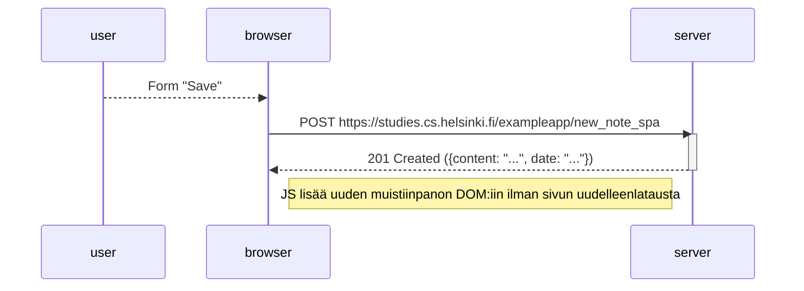

```mermaid

sequenceDiagram
    participant user
    participant browser
    participant server

user-->>browser: Form "Save"
browser->>server: POST https://studies.cs.helsinki.fi/exampleapp/new_note_spa
activate server
server-->>browser: 201 Created ({content: "...", date: "..."})
deactivate server

Note right of browser: JS lisää uuden muistiinpanon DOM:iin ilman sivun uudelleenlatausta

```
