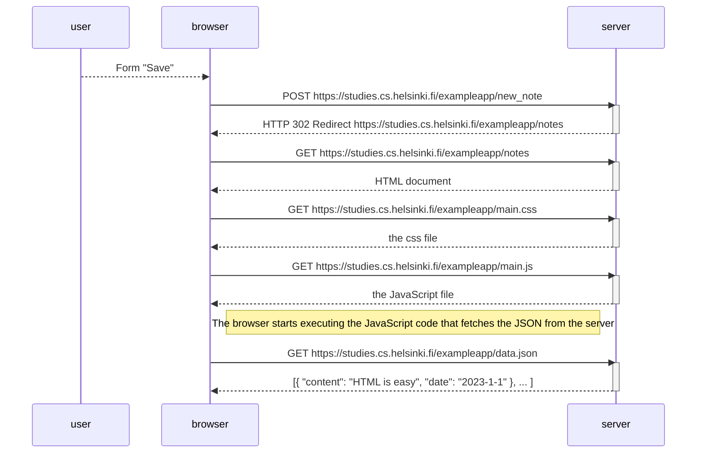
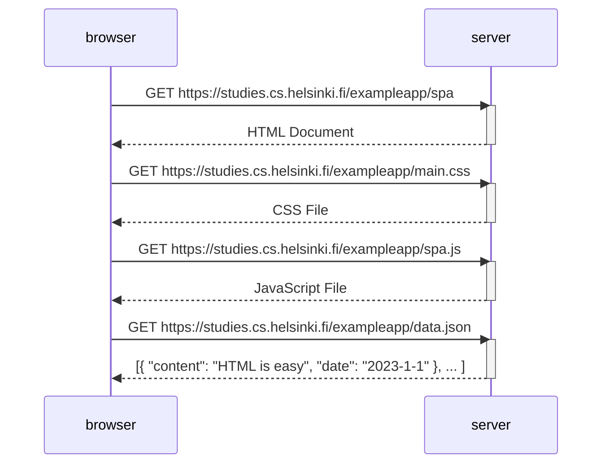
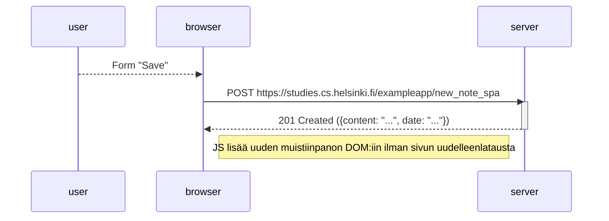

# Tässä kansiossa on palautettavien tehtävien vastaukset Full Stack Open kurssin osasta 0

## Tehtävä 0.4:

Tee vastaavanlainen kaavio, joka kuvaa, mitä tapahtuu tilanteessa, jossa käyttäjä luo uuden muistiinpanon ollessaan sivulla https://studies.cs.helsinki.fi/exampleapp/notes eli kirjoittaa tekstikenttään jotain ja painaa nappia tallenna.

Kirjoita tarvittaessa palvelimella tai selaimessa tapahtuvat operaatiot sopivina kommentteina kaavion sekaan.

Kaavion ei ole pakko olla sekvenssikaavio. Mikä tahansa järkevä kuvaustapa käy.

Voit tehdä kaaviot millä ohjelmistolla haluat, mutta suositeltava tapa on tehdä ne suoraan GitHubiin Markdown- eli md-päätteisiksi tiedostoiksi käyttäen Mermaid-syntaksia.

## Tehtävä 0.5:

Tee kaavio tilanteesta, jossa käyttäjä menee selaimella osoitteeseen https://studies.cs.helsinki.fi/exampleapp/spa eli muistiinpanojen Single Page App-versioon

## Tehtävä 0.6:

Tee kaavio tilanteesta, jossa käyttäjä luo uuden muistiinpanon single page ‑versiossa.

